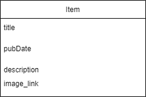
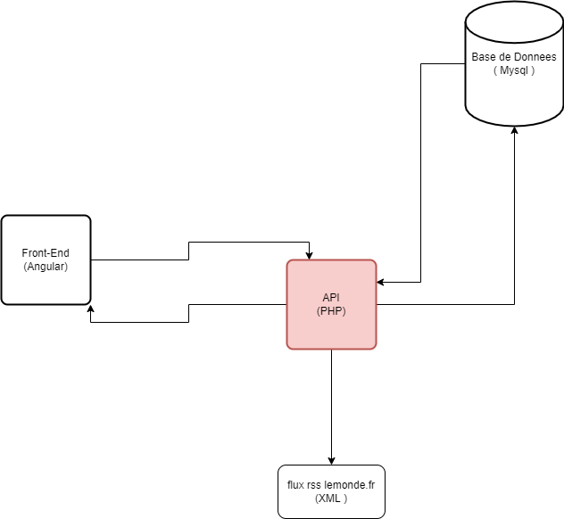
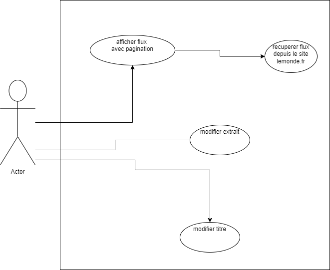
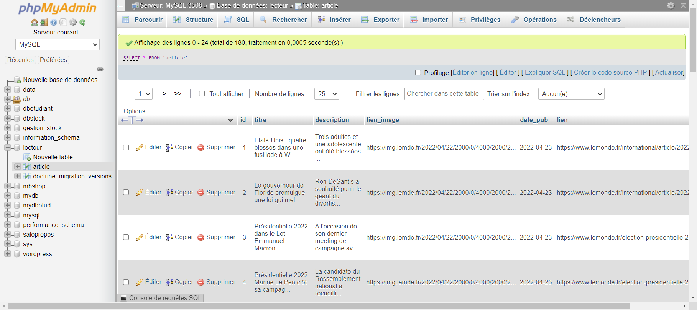
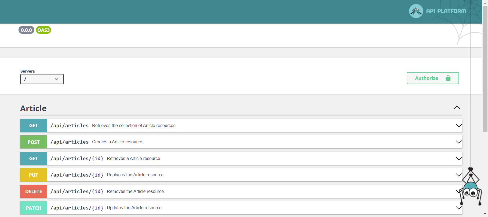
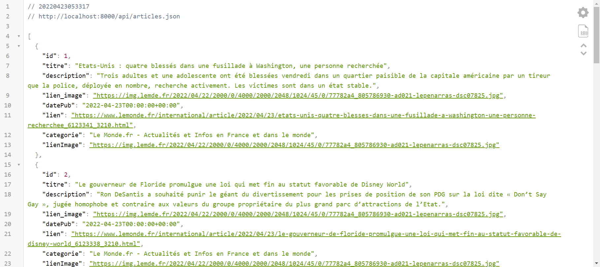
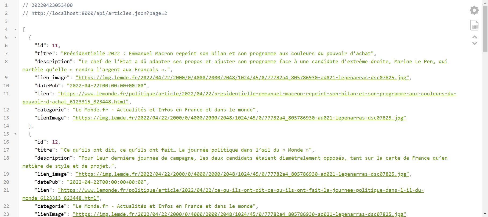
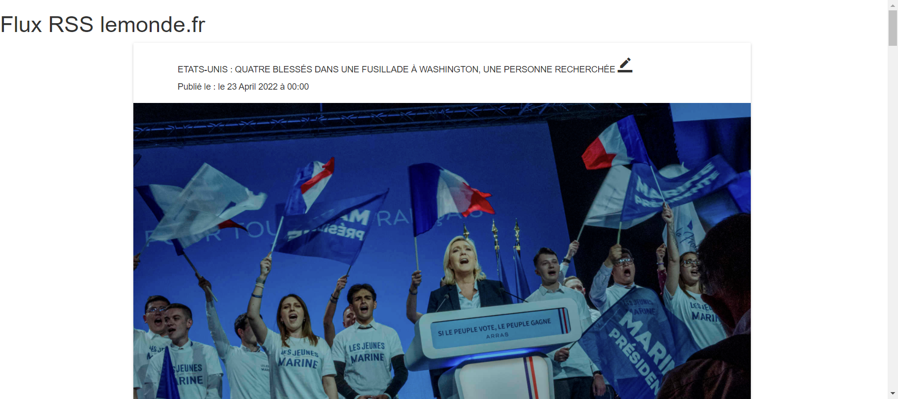

#techonogie utilisees:

- symfony (surtout la partie Doctrine pour la base de donnee)
- https://api-platform.com/ pour la creation de notre endpoint
- base de donnees mysql
- github pour la mise en ligne de mes repository
- angular 12 pour consommer mon endpoint
- bootstrap et materiel design pour la mise en forme du site

# Lecteur flux rss lemonde.fr

#modelisation

#capture-decran-similation-projet

